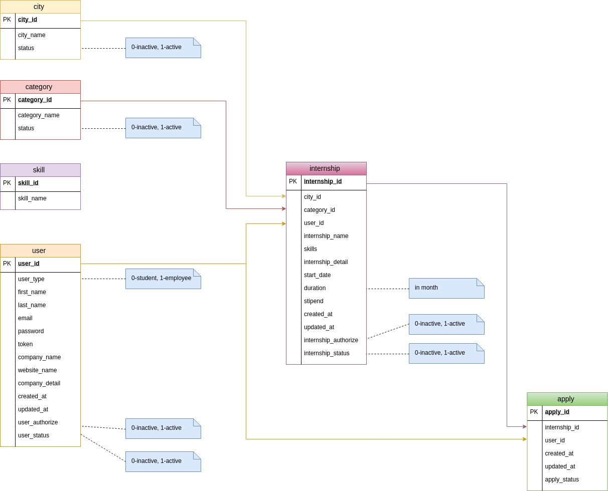

# Internshala Lite

A simple internshala lite project in laravel.

# Problem Statement

Design and develop a web application (in PHP), which will be an internship portal similar to that of Internshala, but on a much smaller scale. 
 
* The application will have 2 kinds of users i.e. students and employers.
* After registering, the employer should be able to post internships with bare minimum details. Internship posting should be restricted only to an employer and a student as well as a non registered user should not be allowed.
* There should be a page which should display all the internships being posted by employer. This page should be accessible to everyone irrespective of whether the user is even logged in.
* A student should be able to apply to any internship she may want. If the student has already applied for an internship, she should be restricted from applying again. If the user is not logged in, she should be redirected to the login page. And if the user is logged in as an employer, he should not be allowed to apply.
* The employer should be able to see all the application she has received for his internships.

# Technologies:

**front-end** : HTML , CSS , JavaScript , Jquery , Materialize

**back-end** : PHP, Mysqli, JSON

**framework** : Laravel

**Software** : Xampp, Any browser

# Setup and Installation

* Download the zip file of this directory.
* Copy the file into your xampp htdocs location. by default the location is C://xampp/htdocs
* Open the xampp controller and start Apache and Mysql
* Open any browser any type localhost/phpmyadmin in the URL
Create a new database internshala_lite
* Select this database and click on import section.
* Now everything is set. Open your browser any type this : localhost/blood_bank

# ER diagram

Entity relationship diagram of this project
